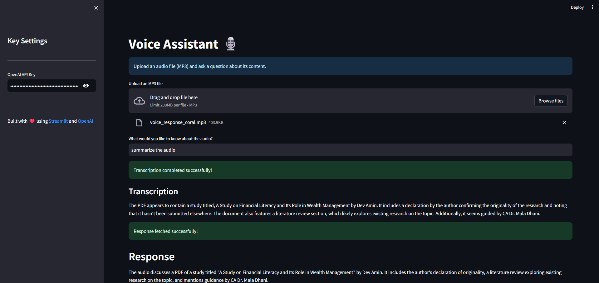

# Voice Assistant

This is a simple voice assistant built with Streamlit and OpenAI APIs. It allows users to upload an MP3 audio file and ask questions about its content. The application transcribes the audio using OpenAI's Whisper model and then uses a language model (GPT-4o-mini) to answer the user's query based on the transcription.



## Features

- Upload MP3 audio files.
- **Record audio directly from your microphone.**
- Transcribe audio using OpenAI Whisper.
- Ask questions about the audio content.
- Get answers generated by OpenAI GPT-4o-mini based on the transcription.

## Setup

1. **Clone the repository:**

   ```bash
   git clone https://github.com/your_username/Voice_Assistant.git
   cd Voice_Assistant
   ```

2. **Create a virtual environment (recommended):**

   ```bash
   python -m venv venv
   ```

3. **Activate the virtual environment:**

   - On Windows:
     ```bash
     .\venv\Scripts\activate
     ```
   - On macOS and Linux:
     ```bash
     source venv/bin/activate
     ```

4. **Install dependencies:**

   ```bash
   pip install -r requirements.txt
   ```
   *(Note: You will need to create a `requirements.txt` file with the necessary dependencies like `streamlit` and `openai`)*

5. **Get an OpenAI API Key:**

   Obtain an API key from the [OpenAI website](https://platform.openai.com/).

6. **Run the application:**

   ```bash
   streamlit run main.py
   ```

7. **Enter your OpenAI API Key:**

   Once the application is running in your browser, enter your OpenAI API key in the sidebar.

## Usage

1. Upload an MP3 audio file using the file uploader OR click the microphone button to record audio directly.
2. If recording, click the stop button when finished. The recorded audio will appear.
3. Enter your question about the audio content in the text input field.
4. The application will transcribe the audio (either from the uploaded file or the recording) and then provide an answer based on your question and the transcription.
5. You can download the recorded audio using the provided button.

## Contributing

Feel free to contribute to this project by opening issues or submitting pull requests.

## License

This project is licensed under the MIT License - see the [LICENSE](LICENSE) file for details.